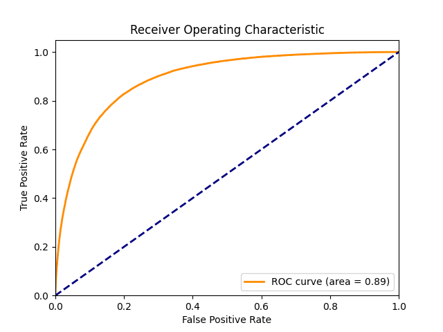
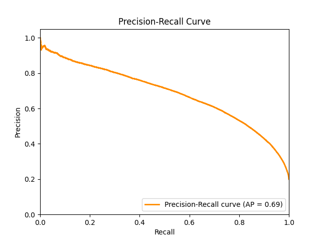

# <span class="custom-heading">Binding Affinity Prediction Documentation</span>

## <span class="custom-heading">Introduction</span>

This documentation outlines the process of building a model to predict the binding affinity between a given MHC sequence
and peptide sequence. The binding affinity refers to the strength of interaction between a major histocompatibility
complex (MHC) molecule and a peptide. This project has implications in immunology and drug discovery research, aiding in
understanding immunogenicity, identifying epitopes, and developing therapeutic interventions.

## <span class="custom-heading">Dataset</span>

The dataset contains the following columns:

- **MHC Sequence:** A string representing the MHC sequence.
- **Peptide Sequence:** A string representing the peptide sequence.
- **Label:** A binary label indicating the binding affinity (0 or 1).

## <span class="custom-heading">Model Development</span>

### <span class="custom-heading">Token Embedding</span>

In this project, token embeddings were utilized to represent the amino acid sequences of MHC and peptide molecules.
Specifically, 3-gram embeddings were used to capture local sequence patterns and information. The embeddings were
obtained using a pre-trained model from the [biovec repository](https://github.com/kyu999/biovec), which provides
protein sequence embeddings. This approach allows us to represent each token (3-gram) in the sequence as a dense vector,
effectively capturing the contextual information of neighboring amino acids.

For sequences with lengths not divisible by 3, a handling strategy was employed to ensure accurate representation. In
such cases, the last embedding was created from the remaining amino acids, resulting in a 3-gram that captures the
available sequence information. For example, given the sequence 'MRVTAPRTLL', which is divisible by 3, the 3-grams
are [MRV, TAP, RTL, LLL]. On the other hand, for a sequence like 'MRVTAPRTLL' with a length not divisible by 3, the
3-grams are [MRV, TAP, RTL, TLL], capturing the last two amino acids as a single 3-gram.

- [ProtVec Paper](https://arxiv.org/abs/1503.05140): The original paper introducing ProtVec embeddings and the concept
  of representing proteins as continuous vectors.

- [BioVec Repository](https://github.com/kyu999/biovec): The GitHub repository for the `biovec` library, which provides
  pre-trained protein sequence embeddings and tools for utilizing them in various tasks.

Using token embeddings allows our model to leverage sequence information in a meaningful and data-driven manner,
contributing to the accurate prediction of binding affinities between MHC and peptide sequences.

### <span class="custom-heading">Model Architecture</span>

Our model architecture is composed of two main components:

1. **Custom Embedding Layer:** We designed a custom embedding layer called `CustomEmbedding` to map input tokens to
   their corresponding embeddings. This layer is crucial for processing sequences of tokens efficiently and capturing
   their underlying semantic information. The custom embedding layer addresses two important aspects:

    - **Token Embeddings:** Each input token is first mapped to its pre-trained embedding using an embedding dictionary.
      These embeddings encode the token's semantic meaning and contribute to capturing the sequence's characteristics.

    - **Padding for Sequence Alignment:** Sequences often have varying lengths, which can pose challenges for neural
      network processing. To ensure consistent input dimensions across sequences, padding is added. Padding involves
      adding special tokens (e.g., zeros) to sequences to make them uniform in length. The `CustomEmbedding` layer
      incorporates this padding mechanism using the `nn.utils.rnn.pad_sequence`
2. **Neural Network for Predicting Binding Affinities:** Our core model is named `MyModel`, which is a custom neural
   network designed using PyTorch. This network predicts binding affinities between peptides and MHC alleles. It
   leverages the power of token embeddings to encode sequence information effectively. The model architecture includes:

    - **MHC and Peptide Embedding:** Utilizes the `mhc_embedder` and `peptide_embedder` to embed MHC sequences and
      peptide sequences, respectively, using 3-gram embeddings. These embeddings capture local sequence patterns and
      contextual information.

    - **LSTM Layers:** Employs Long Short-Term Memory (LSTM) layers for both peptides and MHC sequences. The LSTM layers
      allow the model to capture sequential dependencies and relationships within the input sequences.

    - **Linear Layers:** Applies fully connected linear layers to process the LSTM outputs. These layers enable the
      model to learn complex interactions and patterns in the embedded sequences.

    - **Activation Functions:** Utilizes the ReLU activation function to introduce non-linearity and promote model
      expressiveness.

    - **Final Output Layer:** Outputs the predicted binding affinities between peptides and MHC alleles after passing
      through linear and activation layers.

This architecture is designed to effectively learn from sequence data and make accurate predictions of binding
affinities between peptides and MHC alleles. It leverages the token embeddings and LSTM layers to capture intricate
sequence relationships and patterns.

For further details on the architecture's design and components, you can refer to the code provided in the `networks.py`
file.

---

**Note:** The code provided in the `networks.py` file implements the architecture as described above. The model's
capabilities to predict binding affinities are enhanced by processing sequences using 3-gram embeddings and LSTM layers.
This architecture has been fine-tuned for optimal performance in predicting binding affinities between MHC and peptide
sequences.

### <span class="custom-heading">Training and Evaluation</span>

We trained and evaluated the model as follows:

1. **Training:** Split the dataset into train, validation, and test subsets. Used binary cross-entropy loss for
   optimization.
2. **Evaluation Metrics:** Assessed model performance using accuracy, precision, recall, and F1-score.

## <span class="custom-heading">Model Evaluation</span>

We evaluated our model using standard metrics:

- **Accuracy:** The proportion of correct predictions.
- **Precision:** The proportion of true positives among predicted positives.
- **Recall:** The proportion of true positives among actual positives.
- **F1-Score:** The harmonic mean of precision and recall.
- **Receiver Operating Characteristic (ROC) Curve:** A graphical representation of the true positive rate against the
  false positive rate, which helps assess the model's trade-off between sensitivity and specificity.
- **Precision-Recall Curve:** A graphical representation of the precision against the recall, providing insights into
  the model's performance across different decision thresholds.

## <span class="custom-heading">Project Structure</span>

The project directory has the following structure:

```
Project Structure
├── data (directory)
├── results (directory)
├── trained_models (directory)
├── config.py 
├── data_utils.py 
├── Dataset.py 
├── device.py 
├── evaluate.py 
├── hyperparameter_tuning.py 
├── mapper.py 
├── networks.py 
├── train.py 
└── train_utils.py 
```

### <span class="custom-heading">File Descriptions</span>

- **config.py:** Contains configuration parameters for the neural network, such as embedding dimensions, LSTM hidden
  sizes, and linear layer outputs.(The best hyperparameters found are already in the file)

- **data_utils.py:** Provides a function to load, split, and create data loaders for the dataset.

- **Dataset.py:** Defines a custom dataset class, `BindingAffinityDataset`, to handle dataset loading and
  transformation.

- **device.py:** Configures the device to be used for computations, preferably CUDA if available.

- **evaluate.py:** Evaluates the trained model's performance using various metrics like accuracy, precision, recall, F1
  score, ROC curve, and precision-recall curve.

- **hyperparameter_tuning.py:** Performs hyperparameter tuning for the model using a random search approach.

- **mapper.py:** Creates embeddings for MHC and peptide sequences using pre-trained ProtVec embeddings, maps sequences
  to integer indices, and saves the processed dataset in data directory.

- **networks.py:** Defines the neural network model, `MyModel`, using PyTorch for predicting binding affinities.

- **train.py:** Contains the training loop for the model, along with saving checkpoints and monitoring convergence.

- **train_utils.py:** Provides utility functions for training and evaluation, including the `train` and `evaluate`
  functions.

## <span class="custom-heading">Usage</span>

1. **Data Preparation:**
    - Place your dataset file in the `data` directory.
    - Run `mapper.py` to create embeddings, map sequences to indices, and generate the final processed dataset.
    - remember you need to have the pre-trained protvec model in the trained_models directory before you run this
      script.

2. **Model Training:**
    - Configure hyperparameters in `config.py`.
    - Run `train.py` to train the model using the processed dataset.
    - Trained models will be saved in the `trained_models` directory.

3. **Evaluation and Hyperparameter Tuning:**
    - Use `evaluate.py` to assess the trained model's performance.
    - Run `hyperparameter_tuning.py` for hyperparameter tuning and model optimization.

4. **Results and Visualization:**
    - Trained model evaluation results are available in the `results` directory.
    - Various plots such as ROC curves and precision-recall curves will be displayed.

### <span class="custom-heading">Results</span>

After training and evaluating our model, we assessed its performance using a variety of metrics to measure its
effectiveness in predicting binding affinities between peptides and MHC alleles. The evaluation process involved
comparing the model's predictions with the ground truth labels in the test dataset. The following metrics were used to
gauge the model's performance:

- **Accuracy:** Measures the proportion of correctly predicted instances out of the total instances.

- **Precision:** Calculates the ratio of true positive predictions to the total instances predicted as positive. This
  metric emphasizes the correctness of positive predictions.

- **Recall:** Also known as sensitivity or true positive rate, recall measures the ratio of true positive predictions to
  the total instances that are actually positive.

- **F1 Score:** Combines both precision and recall to provide a balanced measure of the model's performance.

- **Receiver Operating Characteristic (ROC) Curve:** A graphical representation of the true positive rate against the
  false positive rate, which helps assess the model's trade-off between sensitivity and specificity.

- **Precision-Recall Curve:** A graphical representation of the precision against the recall, providing insights into
  the model's performance across different decision thresholds.

- **Confusion Matrix:** A table that summarizes the classification results on a classification problem. It provides
  insights into the true positive, true negative, false positive, and false negative predictions.


- Accuracy: 0.8611
- Precision: 0.8529
- Recall: 0.8611
- F1 Score: 0.8550
- Area Under the ROC Curve (AUC): 0.8913
- Average Precision: 0.6855

#### ROC Curve


The Receiver Operating Characteristic (ROC) curve visualizes the model's true positive rate against the false positive
rate.

#### Precision-Recall Curve


The Precision-Recall curve illustrates the trade-off between precision and recall for different decision thresholds.

```
Confusion Matrix:
|                 | Predicted Positive | Predicted Negative |
|-----------------|--------------------|--------------------|
| Actual Positive | 134657             | 8816               |
| Actual Negative | 16086              | 19748              |
```

These metrics collectively offer a comprehensive view of the model's predictive capabilities. The ROC curve and
precision-recall curve visualize the model's ability to distinguish between positive and negative instances, while
accuracy, precision, recall, and F1 score provide quantitative measures of its performance.

Our model's architecture, which utilizes 3-gram embeddings and LSTM layers, has been fine-tuned to optimize these
evaluation metrics. The resulting performance metrics are crucial for assessing the practical utility of the model in
predicting binding affinities between MHC alleles and peptide sequences.

## <span class="custom-heading">Conclusion</span>

This project showcases the process of predicting binding affinity between MHC and peptide sequences using machine
learning techniques. By following the outlined steps and utilizing the provided code, you can build, train, evaluate,
and optimize your binding affinity prediction model.

If you have any questions or need further assistance, feel free to contact me at m.masoumpouraskari@gmail.com.

## Acknowledgments

- I would like to acknowledge the valuable assistance provided by ChatGPT, an AI language model developed by OpenAI.
  ChatGPT was used to help generate this documentation, and was used along the development of the
  model.


- I would like to acknowledge the significant insights from
  the [MHCAttnNet: predicting MHC-peptide bindings for MHC alleles classes I and II using an attention-based deep neural model](https://www.ncbi.nlm.nih.gov/pmc/articles/PMC7355292/)
  paper, The initial model and base code was used from this
  paper's [GitHub repository](https://github.com/gopuvenkat/MHCAttnNet).

<style>
.custom-heading {
    color: #008000;
}
</style>


